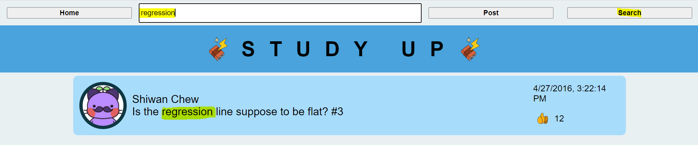

# Homework-Board

## Goal
Homework Board is a web application that allows students easy access to an interactive platform to ask questions while completing homework assignments and form study groups.

In creating this service, I practiced developing both the client side JavaScript as well as the webservice used for a website.  

The app.js file is the root of the directory. The forward facing static files (HTML, CSS and client side JS) are located in the **public** directory. HB.db is a database that holds all information from individual users. 

## Applications and Frameworks
- Utilized Node.js and Express to build a REST API server
- All data stored in a database using SQLite.
- Client built using HTML, CSS, & JavaScript; 

## Features
Users can choose from a variety of features to interactive with other classmates.
- Users start in the home screen and can scroll throw the posts of other classmates. like, create, search, filter, and delete posts. 

- Users may upvote their peers questions to gravitate more attention towards questions that other classmates may have as well.

- Users can easily create a new post by clicking the 'post' button and entering their question, followed by the question number.

- Users may filter questions by classmate name by clicking on the profile name of a specific classmate.

- Users may search a specific query to find all questions posted that may be relevant to a specific thought or question.

